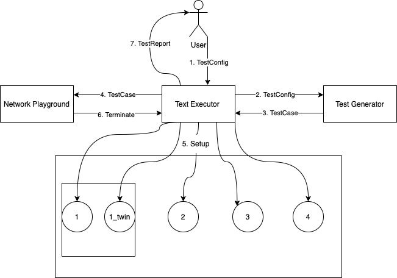
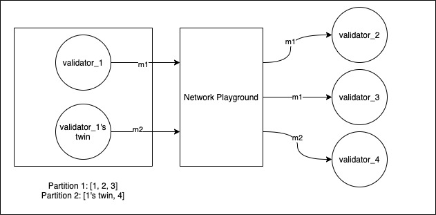

# DiemTwins: A testing framework for Diem BFT using the Twins approach

## Overview
This document describes in detail the design of DiemTwins, a testing framework for the Diem BFT algorithm. 
The testing framework is intended for a version of DiemBFT implemented using Python 3.7 and DistAlgo, and
correspondingly, the pseudocode that is part of the design follows a similar syntax.  

## Design
__Note:__ All the data types(TestConfig, TestCase etc.) mentioned in the 'Design' section are described in detail 
in a subsequent 'Models' section.

### Test parameters

* n_rounds: Number of rounds of execution
* n_validators: Number of validators 
* n_twins: Number of (faulty) validators that will have a twin
* n_partitions: Maximum number of partitions
* is_deterministic: Whether to generate the test case deterministically or randomly
* seed: In case of random testcase generation, what seed to use

### Test Executor



The Test Executor is the module which the user primarily interacts with in order to run test cases. 
The user passes a list of TestConfig objects as a JSON file. Each TestConfig object describes a testcase that needs
to be executed by the DiemTwins testing framework.

The Test Executor orchestrates each testcase independently. For each test case, it follows the following steps:

1. Invokes Test Generator, passing the TestConfig corresponding to the testcase as a parameter. Receives a TestCase object as a response.
2. Sets up an instance of Network Playground by passing a TestCase object as a parameter.
3. Picks a validator id that does not have a twin as a default leader. This will be used by the leader election module for round numbers that exceed n_rounds for which we have generated test cases.
4. Generates public-private key pairs for each validator id(1, 2...n_validators).
5. Sets up each validator(including twins) by passing its validator_id, a list of all validator_ids, f(number of byzantine replicas tolerated), its private key, all public keys, delta(bound on message transmission delay), n_rounds, twin_id<sup>1</sup>, a list of leaders for each of n_rounds obtained from Test Generator and the default leader for subsequent rounds.
6. Waits for Network Playground module to send a 'Terminate' message, which indicates that all non-faulty replicas have completed n_rounds + 3 rounds, and we can consider the testcase to be executed. 
7. Executes safety and liveness checks. Generates a report for the test case, describing the test configuration, the test case generated by Test Generator and the result of the safety and liveness checks. 

<sup>1</sup>Here, twin_id is used to uniquely identify validators from their twins. It is expanded upon in subsequent sections.  

#### Design decisions and assumptions

Here, we briefly list out the design decisions/assumptions taken in addition to the ones presented in the Twins paper and the phase 3 document.

* The twins testing framework requires the leaders for each round of DiemBFT to be deterministic. We implement this by passing a list of leaders for each round, along with a default leader for subsequent rounds to each validator. We also create a new leader_election_twins module which will use this input and override DiemBFT's existing leader election module.
* The Test Executor depends on the Network Playground module to determine when the testcase has finished executing. We use this division of responsibility as the Network Playground, by simulating all message sends, is already aware of the internal state of our system.
* We let each validator run for n_rounds + 3 rounds. Here, the first n_rounds will be simulated as per the TestCase generated by our Test Generator module. We will then allow the system to execute 3 more rounds without any network partitions. This will allow all non-faulty replicas to commit any pending blocks, and bring their ledgers up to date.

### Test Generator

For the Test Generator, we closely follow the approach specified in section 4.2 of the Twins paper. The modifications that
we have made is presented in the Design decisions sub-section, and the pseudocode is presented in a later section.

#### Design decisions

We have decided to modify the step 3 described in the Section 4.2 of the twins paper. Rather than enumerating all possible 
permutations for n_rounds, we just enumerate all permutations of leader_partitions(described in Step 2 of the same section),
and generate the testcase by picking n_rounds number of leader_partitions from our enumeration. This picking is either done 
deterministically(picking the permutation from start to end), or by doing a random pick with replacement, based on the input parameter.
We also let the user provide a seed for performing this random generation of testcase, to ensure reproducibility of test cases.

As an extension of the previous decision, we are not loading any permutations from a file. Since we are not enumerating all 
partition scenarios for n_rounds, the number of permutations we need to generate is greatly reduced, and we can do it on 
the fly without a significant performance penalty.

We have also decided to emulate intra-partition dropping of messages(described in section 2 of the phase 3 document) by including 
a field 'allowed_messages' in the leader_partition object. For each leader_partition scenario, there can also optionally be
a subset of {'ProposalMessage', 'VoteMessage'} which will be dropped even when sending the message intra-partition.

Finally, in order to ensure progress in our test cases, we have implemented a condition that every 3 rounds, the leader partition
scenario will have a partition where a quorum can be formed. This will ensure that a minimum number of transactions get committed in
the ledger at the end of the test case.

### Network Playground



The Network Playground module lies at the heart of our simulation of the twins testing protocol. 
All messages sent by validators(ProposalMessage, VoteMessage, TimeoutMessage etc.) are first sent to the 
Network Playground module. The module then simulates the network partitions defined by the generated test case for that 
round. Only if the sender and receiver of the message are part of the same partition, and the message is not configured 
to be dropped within the partition for the round, we will send the message.

In case the round number has exceeded n_rounds(this will be in the last three rounds where we commit the 'LastTransaction'
block for our liveness check), then the network playground will directly forward the message without applying any filtering
based on network partitions. 

The Network Playground also handles the responsibility of tracking the round of the system. If all the honest validators
have completed the number of rounds required by the test case, the Network Playground will send a 'Terminate' message to
the Test Executor.

#### Design decisions

We have decided to let the Network Playground module to handle the responsibility of tracking rounds. Since the network 
playground is already exposed to the different messages sent between validators, it can easily extract information about 
the current round without creating an additional coupling between the DiemBFT system and the DiemTwins testing 
framework to achieve the same.

### Changes to DiemBFT module

In this section, we list out the modifications that need to be made to the code of DiemBFT in order to accommodate the 
design of DiemTwins. 

#### Network Playground

In order to simulate network partitions in our testcases, we have created a Network Playground module. We need to modify
the code for DiemBFT and re-route any sends through the Network Playground module. Instead of sending a message directly
to another validator, a validator will simply send the message to Network Playground and piggyback the intended recipient 
as well as the round number. The Network Playground then applies a filtering logic described above, and forwards the message
accordingly. 

We need to modify all places where DiemBFT sends a message to another validator, and instrument the message sending via the Network Playground.

#### Leader election

As described in section 6.1 of the Twins paper, leader election needs to be made deterministic, so that all validators 
agree on the list of leaders generated by our Test Generator module. This means that the existing leader_election module
of DiemBFT needs to be replaced with a new leader_elections_twins module, which assigns leaders for rounds 
deterministically based on the list of leaders provided by Test Executor.

#### Mempool

As described in section 6.1 of the Twins paper, each validator must propose a new block using a mock block generator. It 
is required that each of the blocks generated in this way need to be unique for our safety and liveness checks to work. 
We achieve this by overriding the mem_pool module of DiemBFT. Rather than accepting transactions from clients and 
proposing them in order, we create a new mempool_twins module, which returns a random payload every time it is called. 
One we have completed all rounds of our testcase, it returns a special payload 'Last_transaction', for our liveness check.

DiemBFT simply needs to use this new mempool_twins module when creating payload for new proposed blocks.

## Models

### TestConfig

```
class TestConfig:
    # Number of rounds in the test case
    n_rounds: int
    # Number of validators for the BFT
    n_validators: int
    # Number of validators that will have a twin
    n_twins: int
    # Maximum number of network partitions that will be created
    n_partitions: int
    # Whether to generate test cases deterministically or not
    is_deterministic: bool
    # Seed for random number generator used for test cases
    seed: int
```

### LeaderPartition

```
class LeaderPartition:
    # Leader for that round
    leader: int
    # List of lists. Each nested list represents a partition, which consists of twin_ids of validators that
    # are a part of that network partition
    partitions: List[List]
    # List of messages(ProposalMessage, VoteMessage) that will be dropped within a partition.
    # By default, none of the messages are dropped.
    dropped_messages: List[str]
```

### TestCase

```
class TestCase:
    # Number of rounds in the test case
    n_rounds: int
    # Number of validators for the BFT
    n_validators: int
    # List of leader-partition combinations described in Step 2 of section 4.2 in the twins paper
    leader_partitions: List[LeaderPartition]
    # List of validator IDs that have a twin
    twin_ids: List[int]
```

## Pseudocode

### Test Executor

```
from twins.validator import TwinsValidator


class TestExecutor:
    def execute(self, test_configs):
        for test_config in test_configs:
            # Pass the config to test_generator and generate the test case
            test_case = self.test_generator.generate_test_case(test_config)

            # Spawn the network playground with the generated test case
            network_playground = new(NetworkPlayground, num=1)
            setup(network_playground, test_case)
            run(network_playground)

            validator_ids = range(1, test_config.n_rounds+1)

            # Pick a non-faulty validator to be the default leader after n_rounds are executed
            for validator_id in validator_ids:
                if validator_id not in test_case.twin_ids:
                    default_leader = validator_id
                    break

            # Get the list of leaders to setup validators leader_election
            leaders = [leader_partition.leader for leader_partition in test_case.leader_partitions]

            # Generate public-private key pairs for each validator. crypto.generate_key_pairs
            # returns a dictionary mapping validator_id to the public_private key pair
            public_private_keys = crypto.generate_key_pairs(test_config.n_validators)
            public_keys = [public_private_keys[validator_id].public_key for validator_id in validator_ids]

            # Setting up validators and twins
            for validator_id in validator_ids:
                private_key = public_private_keys[validator_id].private_key

                # Spawn the normal validator
                validator = new(TwinsValidator, num=1)
                setup(
                    validator,
                    (validator_id, validator_ids, f, private_key, public_keys, delta,
                        test_config.n_rounds,
                        # The twin_id for normal validators is same as the validator_id
                        str(validator_id),
                        leaders, default_leader
                    )
                )
                run(validator)

                # Spawn the twin validator
                if validator_id in test_case.twin_ids:
                    twin_validator = new(TwinsValidator, num=1)
                    setup(
                        twin_validator,
                        (validator_id, validator_ids, f, private_key, public_keys, delta,
                            test_config.n_rounds,
                            # For twins, we append a _twin for the twin_id
                            str(validator_id) + "_twin",
                            leaders, default_leader
                        )
                    )
                    run(twin_validator)

            # Wait for network playground to indicate that the test case is terminated
            await(('Terminate'), from_=network_playground)

            # Perform safety and liveness checks
            safety_check = twins_validation.safety_check(validator_ids, test_case.twin_ids)
            liveness_check = twins_validation.liveness_check(validator_ids, test_case.twin_ids)

            # Generate test report
            reporting.generate_test_report(test_config, test_case, safety_check, liveness_check)
```

#### Safety and liveness checks

```
# We will ensure safety property in offline mode.
# For all non-faulty validators, check if all the transactions are committed in the same order.
def safety_check(validator_ids, twin_ids):
    # First we generate list of honest validators
    honest_validators = []
    for validator_id in validator_ids:
        if validator_id not in twin_ids:
            honest_validators.append(validator_id)

    # For each pair of honest validators, we check if their ledgers match
    for first_validator_id in honest_validators:
        for second_validator_id in honest_validators:
            if not verify_ledger_files(
                    read_ledger_file(first_validator_id),
                    read_ledger_file(second_validator_id)
            ):
                return False

    return True


def verify_ledger_files(ledger_file_1, ledger_file_2):
    # Compare transactions in ledger line-by line and see if they match
    for ledger_entry_1, ledger_entry_2 in zip(ledger_file_1, ledger_file_2):
        if ledger_entry_1 != ledger_entry_2:
            return False
    return True


# At the end of n_rounds, the new leader proposes a block with payload as 'Last_transaction',
# and we do not create any network partitions.
# If this block commits, then we have passed the liveness check
def liveness_check(validator_ids, twin_ids):
    for validator in validator_ids:
        if validator not in twin_ids:
            ledger_file_validator = read_ledger_file(validator)
            # Checks the last committed transaction in all honest validators
            if ledger_file_validator[-1] != "Last_transaction":
                return False
            else:
                return True


# Returns a list of all transactions committed in a validator's ledger
def read_ledger_file(validator_id):
    # Assume that ledger is named like ledger_1.txt etc
    validator_ledger_filename = 'ledger_' + validator_id + '.txt'
    file = open(validator_ledger_filename, 'r')

    # returns all lines in ledger file as a list
    return file.readlines()
```

### Test Generator

```
import random

# Generates a TestCase for an input test_config from the user
from twins.models.models import TestCase, LeaderPartition


def generate_test_case(test_config):
    # Applies seed if present
    if test_config.seed is not None:
        random.seed(test_config.seed)

    validator_ids = [i for i in range(1, test_config.n_validators + 1)]
    twin_ids = random.sample(validator_ids, test_config.n_twins)

    # Generate a list of all validators including twins
    validator_twin_ids = [str(validator_id) for validator_id in validator_ids]
    for twin_id in twin_ids:
        validator_twin_ids.append(str(twin_id) + "_twin")

    # Generate all possible partition scenarios as described in Step 1 of 4.2 in the Twins paper
    partition_scenarios = generate_partition_scenarios(validator_twin_ids, test_config.max_partitions)
    # Generates all possible leader partitions as described in Step 2 of 4.2 in the Twins paper
    all_leader_partitions = generate_leader_partitions(partition_scenarios, test_config.n_validators)

    # Initializes test_case object
    test_case = TestCase()
    test_case.n_rounds = test_config.n_rounds
    test_case.n_validators = test_config.n_validators
    test_case.twin_ids = twin_ids

    # The leader partition scenarios that we will include in this testcase. Size will be n_rounds
    leader_partitions = []

    # In case it is deterministic, we will be picking from our enumeration of leader partitions
    # from start to end
    if test_config.is_deterministic:
        leader_partition_ptr = 0
    else:
        leader_partition_ptr = None

    # Keeps appending leader_partition to the list until we generate for n_rounds.
    while len(leader_partitions) < test_config.n_rounds:
        # If test case is generated randomly, we use random choice with replacement
        # Else we pick from the first element onwards of all permutations
        if leader_partition_ptr is None:
            leader_partition = random.choice(all_leader_partitions)
        else:
            leader_partition = all_leader_partitions[leader_partition_ptr]
            leader_partition_ptr += 1

        # To ensure some progress in our system, we keep a condition that every 3rd round
        # has to have some sort of Quorum possible
        if has_quorum(leader_partition, test_config.f) or len(leader_partitions) % 3 != 0:
            leader_partitions.append(leader_partition)

    test_case.leader_partitions = leader_partitions
    return test_case


def generate_leader_partitions(partition_scenarios, n_validators):
    leader_partitions = []
    for partition_scenario in partition_scenarios:
        for leader in range(1, n_validators + 1):
            dropped_message_scenarios = [[], ['ProposalMessage'], ['ProposalMessage', 'VoteMessage']]
            for dropped_messages in dropped_message_scenarios:
                # For every partition scenario, enumerate with all possible leaders,
                # as well as all possible intra-partition drop message scenario
                leader_partition = LeaderPartition()
                leader_partition.leader = leader
                leader_partition.partitions = partition_scenario
                leader_partition.dropped_messages = dropped_messages
                leader_partitions.append(leader_partition)

    return leader_partitions


# Returns a list of all possible partition pairs using a process similar to
# solving the Stirling Number of Second Kind problem.
# A piece of code to achieve the same can be found at
# https://stackoverflow.com/questions/45829748/python-finding-random-k-subset-partition-for-a-given-list
def generate_partition_scenarios(validator_twin_ids, max_partitions):
    return []


# Checks if the validators in any of the partitions in the leader_partition can form a quorum
def has_quorum(leader_partition, f):
    if len(leader_partition.dropped_messages) > 0:
        return False

    for partition in leader_partition.partitions:
        unique_validators = set()

        for validator_id in partition:
            unique_validators.add(validator_id.lstrip("_twin"))

        if len(unique_validators) >= 2 * f + 1:
            return True

    return False
```

### Network Playground

```
class NetworkPlayground:
    # Sets up the
    def setup(self, test_case):
        self.test_case = test_case
        # HashMap that keeps track of all the rounds that have been reached by the validators
        self.validators_at_round = dict()


    # Receive handler. Waits for message from validators and simulates the partition logic
    def receive(
            self,
            ('ValidatorMessage', to_twin_validator_id, from_twin_validator_id,
             message, message_type, self.twin_id, round_num),
            from_=from_validator_id):

        if round_num > self.test_case.n_rounds:
            # if the round number exceeds the testcase rounds, we will forward the message reliably,
            # without considering any network partitions
            send((message_type, message), to=to_twin_validator_id)
            return

        # Get the leader_partition for the round number
        leader_partition = self.test_case.leader_partitions[round_num]

        # If the sender and receiver are in the same partition, and the message is not
        # dropped within the partition, then send the message
        for partition in leader_partition.partitions:
            if from_twin_validator_id in partition and to_twin_validator_id in partition \
                    and message_type not in leader_partition.dropped_messages:
                send((message_type, message), to=to_twin_validator_id)

        # Generates a list of honest validators(validators that do not have a twin)
        honest_validators = []
        for validator_id in range(1, self.test_case.n_validators + 1):
            if validator_id not in self.test_case.twin_ids:
                honest_validators.append(validator_id)


        if round_num not in self.validators_at_round:
            self.validators_at_round[round_num] = set()

        # we update the validators_at_round hash map to keep track of the latest round that each of
        # the validators have reached
        self.validators_at_round[round_num].add(from_validator_id)

        # As we are executing n_rounds + 3 rounds, if all honest validators have reached that round,
        # we need to terminate this test case.
        if self.test_case.n_rounds + 3 in self.validators_at_round:
            send_terminate = True
            for validator_id in honest_validators:
                if validator_id not in self.validators_at_round[self.test_case.n_rounds + 3]:
                send_terminate = False
                break

            if send_terminate is True:
                send(('Terminate'), to=test_executor)
```

### Changes to DiemBFT

#### Changes in the Validator DistAlgo process

```
class TwinsValidator:
    def setup(
            self,
            validator_id,
            validator_ids,
            f,
            private_key,
            public_keys,
            delta,
            n_rounds,
            twin_id,
            leaders,
            default_leader
    ):
        self.twin_id = twin_id
        # initialize the leader election module with the leaders provided by twins module
        leader_election_twins.initialize(leaders, default_leader)

        # Set up validator as normal using validator_id, validator_ids,
        # f, private_key, public_keys and delta
        pass

    # Pseudocode for sending any message via network playground.
    def send(self, message, message_type, to, round_num):
        send(
            ('ValidatorMessage', to_validator_id, message, message_type, self.twin_id, round_num),
            to=network_playground
        )
```

#### Changes to leader election module

```
from typing import List


# leader_list : list of the leaders in each round.
# default_leader: leader for the "no-op" round after execution of n_rounds.
def initialise(leaders: List, default_leader: int):
    self.leaders = leaders
    self.default_leader = default_leader


# returns the leader for the given round_num and if the round is greater than n_rounds,
# return the default leader.
def get_leader(round_num):
    if round_num < len(self.leaders):
        return self.leaders[round_num]
    else:
        return self.default_leader
```

#### Changes to mempool module

```
import uuid
from typing import Optional


# Returns the unique transaction if the round_num within n_rounds,i.e.
# Number of rounds defined in a test_case generated by the test_generator.
# Once the testcase's n_rounds are completed, it will generate a special transaction
# which will be used to check liveness property, i.e if that transaction is eventually committed
#  and is in the ledger of all the non-faulty validators, then liveness is ensured.
def get_transaction(round_num) -> Optional[str]:
    if round_num < config.n_rounds:
        # Generates a random UUID for the transaction
        t_id = uuid.UUID
        transaction = "Transaction_" + str(t_id)
    else:
        transaction = "Last_transaction"
    return transaction
```

## Contributions

Balaji Jayasankar, SBID 11460535: Documentation, Test Executor, Changes to DiemBFT

Reetu Singh, SBID 113277052: Test Generator, safety check

Prashant Srivastava, SBID 113166491: Network Playground, liveness check

## Thoughts on proposed changes to design for Phase 4

* Logic for pruning out symmetric partitions.
* Remove logic for ensuring quorum for every 3 rounds.
* Allow TimeoutMessages to be dropped inter-partition and intra-partition as well. Add logic in network playground to allow TimeoutMessages for a round after f+1 validators timeout in that round.
* Allow users to limit types of messages dropped intra-partition.
* Is current 'online' test generation fine, or should we generate all possible arrangements over n_rounds?
* Make explicit that we are no longer spawning clients. Does this 'fix' the problem of duplicate transactions committed?